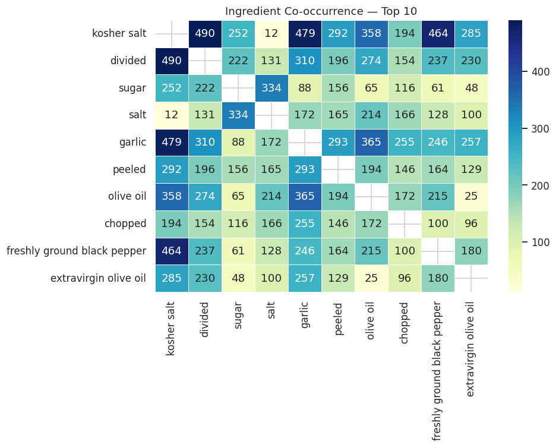
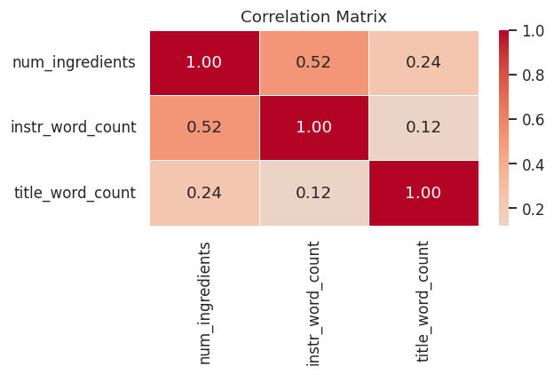

# Cookify - A Smart Recipe Recommender from Available Ingredients

Cookify is a recipe recommendation system that suggests meals based on ingredients you already have, using text preprocessing and similarity matching.

# Overview

**Cookify** is an ingredient-based recipe recommendation system created to help users decide what to cook using the ingredients they already have. The aim is to save time when choosing meals and reduce food waste. The system utilizes text preprocessing and similarity matching to compare user-input ingredients with a dataset of recipes and recommend the most relevant matches.

- **Dataset:** The model is trained on *Food Ingredients and Recipes Dataset with Images* dataset, which contains over 13,000 different recipes.
-  **Preprocessing:** Recipe ingredients are cleaned and normalized by removing quantities, measurement units and punctuation to ensure consistent ingredient representation.
-  **Similarity Matching:** The system compares user's input ingredients with recipe ingredient sets using similarity measurement to identify and rank the most relevant recipes.

# Dataset
## Step 1: Data Source
Cookify uses the [*Food Ingredients and Recipes Dataset with Images*](https://www.kaggle.com/datasets/pes12017000148/food-ingredients-and-recipe-dataset-with-images) dataset that includes 13,582 recipes, covering a wide variety of different cuisines and ingredient combinations. Each recipe has 5 features:
1) **Title:** Name of the meal
2) **Ingredients:** Contains ingredients in the form they were scrapped from the website
3) **Instructions:** Includes steps to follow when making the recipe
4) **Image Name:** A reference to the meal image in the *Food Images* zip folder
5) **Cleaned Ingredients:** Contains processed and cleaned ingredients

## Exploratory Data Analysis (EDA)

The Exploratory Data Analysis was performed on a random sample of **5,000 recipes** drawn from the full *Food Ingredients and Recipe Dataset with Image Name Mapping* dataset (`random_state=42`).

### 1. Dataset Overview

| Feature | Value |
| :--- | :--- |
| **Rows (recipes)** | 5,000 |
| **Columns** | 5 (`Title`, `Ingredients`, `Instructions`, `Image_Name`, `Cleaned_Ingredients`) |
| **Duplicate Rows** | 0 *(Note: Some recipes share titles but differ in content)* |

### 2. Engineered Features

Three numeric features were created to characterize each recipe:
* `num_ingredients`: Number of items in `Cleaned_Ingredients` (proxy for recipe complexity).
* `instr_word_count`: Word count of `Instructions` (proxy for recipe verbosity).
* `title_word_count`: Word count of `Title`.

| Feature | Mean | Median | Std |
| :--- | :---: | :---: | :---: |
| **num_ingredients** | ~9.5 | 9 | ~4.6 |
| **instr_word_count** | ~155 | 120 | ~130 |
| **title_word_count** | ~4.0 | 4 | ~1.8 |

Both `num_ingredients` and `instr_word_count` are **right-skewed**: most recipes are short and simple, but a long tail of elaborate recipes pulls the mean upward.

### 3. Recipe Complexity Distribution

Recipes were binned into four complexity tiers based on their ingredient count:

* **Simple** (1–5 ingredients): ~15% share
* **Moderate** (6–10 ingredients): ~50% share
* **Complex** (11–15 ingredients): ~25% share
* **Elaborate** (16+ ingredients): ~10% share

**Moderate recipes dominate the dataset.** Average instruction length grows steadily with complexity (Moderate recipes average ~120 words, while Elaborate recipes average ~250 words), confirming that ingredient count is a highly reliable proxy for overall recipe difficulty.

### 4. Ingredient Frequency Analysis

Before counting, ingredient strings were pre-processed to reduce text noise by splitting compound entries, normalising to lowercase without units, and filtering short tokens. The final vocabulary contained **~3,700 unique normalized ingredient tokens**.

#### Top 15 Most Frequent Ingredients:
1. **Salt** (2,800+ counts)
2. **Butter** (2,200+ counts)
3. **Sugar** (2,100+ counts)
4. **Olive Oil** (1,900+ counts)
5. **Garlic** (1,800+ counts)
6. **Pepper** (1,700+ counts)
7. **Flour** (1,600+ counts)
8. **Egg** (1,500+ counts)
9. **Onion** (1,400+ counts)
10. **Water** (1,300+ counts)
11. **Milk** (1,100+ counts)
12. **Lemon** (1,000+ counts)
13. **Chicken** (950 counts)
14. **Cream** (900 counts)
15. **Tomato** (850 counts)

### 5. Ingredient Co-occurrence & Correlations

A co-occurrence matrix built for the top 10 ingredients revealed clear culinary patterns:
* **Baking Dominance:** `butter–sugar` and `butter–flour` are the strongest ingredient pairs.
* **Savoriness:** `garlic–olive oil` and `garlic–onion` are the dominant savory co-occurrence pairs.
* **Salt Prevalence:** Salt co-occurs broadly with almost every top ingredient, making it the least discriminative feature for data retrieval.

#### Feature Correlations (Pearson r):
* `num_ingredients` ↔ `instr_word_count`: **~0.35** (Moderate positive correlation)
* `num_ingredients` ↔ `title_word_count`: **~0.05** (No correlation)
* `instr_word_count` ↔ `title_word_count`: **~0.02** (No correlation)

## Step 2: Data Cleaning
Due to computational constraints, we randomly sample 5,000 recipes. Random sampling ensures representative coverage of the whole dataset.
The raw dataset contains malformed rows and missing values. Because of this, we:
1) Removed rows with missing Title or Instructions;
2) Parsed ingredient lists from string format to Python lists;
3) Filtered recipes with empty ingredient lists

## Step 3: Ingredient Preprocessing
We normalized recipes by:
1) Removing quantities and measurement units (cups, tbsp, oz,...);
2) Stripping punctuation and convert everything to lowercase;
3) Applying optional lemmatization to reduce words to base form

# Model architecture
## Experiment 1: Word2Vec Without Lemmatization
### Step 1: Word2Vec training
We train a Word2Vec skip-gram model on the ingredient corpus extracted from the recipes. We use the skip-gram variant because we expect it to better perform on rare ingredients than Continuous Bag of Words would, since it predicts the surrounding words based on the given word.
The model learns vector representations of indvidual igredient tokens, capturing semantic relationships between similar ingredients. For example, 'salt' and 'pepper' as common seasonings are positioned close in the embedding space, whereas 'salt' and 'banana' should be placed further apart.

**Model configuration:**
- **Vector size:** 100 dimensions (how many numbers represent each ingredient in the vector space)
- **Window size:** 5 (determines how many context words should be predicted on each side)
- **Min count:** 1 (includes all ingredients if they show even once)
- **Training algorithm:** sg=1 (Skip-gram)

### Step 2: Recipe vectorization
Each recipe is represented as a single vector by averaging the Word2Vec embeddings of all its ingredient tokens. This captures the overall profile of the recipe by comining individual ingredient semantics.

### Step 3: Similarity matching and recommendation
User ingredients are converted to vectors using the same averaging method. We compute cosine similarity between the user's ingredient vector and all recipe vectors, then rank them and return the top-N most similar recipes.

### Results:
Similarity scores are clustered tightly, limiting the ability to distinguis between recipes. This is likely due to vector averaging causing all recipe vectors to converge to similar regions in embedding space. The recommendation quality is also low, with most recommended recipes having 0-2 matched ingredients.
In the next experiment, we try to improve these results by introducing lemmatization.

## Experiment 2: Word2Vec With Lemmatization
### Step 1: Build the lemmatizer
We build a lemmatizer that will potentially enhance the results of the first experiment, since lemmatization reduces a word to its root form (lemma), considering its meaning and part of speech. For this, we use WordNetLemmatizer.

### Step 2: New Word2Vec training with lemmatization
We again train the same Word2Vec model as in the first experiment, but we apply it to the new corpus, obtained by applying the normalisation function with lemmatization.

### Step 3 and Step 4: Recipe vectorization, similarity matching and recommendation
The last two steps are the same as in the first experiment.

### Results:
The results of this experiment were very similar to those obtained in Experiment 1. The similarity scores are still clustered closely around 0.99 and the improvement in the number of matched ingredients is not very meaningful.
This led us to the conclusion that lemmatization alone is not enough to resolve the problems from the first experiment. The limitation of vector averaging is still fundamental.
In the next experiment, we will try a new approach and fit TF-IDF.

## Experiment 3: TF-IDF Without Lemmatization
### Step 1: TF-IDF vectorization
Now, we replace Word2Vec embeddings with a TF-IDF (Term Frequency-Inverse Document Frequency) representation. It is a frequency-based approach that represenets each recipe as a weighted vector of ingredient terms.
TF-IDF is suitable for a recipe recommendation system because it assigns weights to words, based on how often they appear. For an example, common ingredients, such as 'salt' should recieve lower weight, while more distinctive ingredients receive higher weights. This way, TF-IDF may address the low number of ingredient matches observed in the Word2Vec experiments.
To prepare the data, we converted each recipe's ingredient list into a single string, since TF-IDF expexts text documents as input.
Then, the vectorizer is fitted on the entire recipe corpus, resulting in a sparse matrix where each row represents a recipe and each column a vocabulary term.

**Model configuration:**
- **Vectorizer:** TF-IDF
- **Input:** normalized ingredients strings
- **Representation:** sparse term-weight matrix
- **Similarity metric:** Cosine similarity

### Step 2: Similarity matching and recommendation
For recipe recommendation, the user's ingredient list is processed using the same normalisation pipeline as the recipes. The resulting ingredients are joined into a query string and then transformed into a TF-IDF vector using the fitted vectorizer.
Then, like in the first two experiments, we compute cosine similarity between the user's input and all recipe vectors. Again, the recipes are ranked according to similarity score and the top-N most similar ones are returned as recommendations.

### Results:
TF-IDF model showed a noticeable improvement over both Word2Vec experiments. The similarity scores are distributed into a much wider range instead of being clustered around a single value. Hence, cosine similarity can better distinguish between recipes and produce a more meaningful ranking.
However, the number of matched values remains relatively low. This suggests that query terms still fail to match more descriptive ingredient names.
Overall, TF-IDF experiment significantly outperformed the Word2Vec approaches, since it avoids the vector averaging problem. Because of this improvement, we resume with TF-IDF approach and now investigate whether lemmatization can further improve its performance.

## Experiment 4: TF-IDF With Lemmatization
### Step 1: Lemmatized TF-IDF vectorization
In this experiment, we will combine the TF-IDF from Experiment 3 with the lemmatization procedure from Experiment 2. The reasoning is the same as before: lemmatization reduces words to their base form, while considering their meaning and grammatical role. Applying lemmatization may improve the representation by merging different forms of the same words.
As in the previous experiment, each recipe is converted into a string of normalized ingredient tokens, but normalisation process now includes lemmatization before fitting the TF-IDF vectorizer.
**Model configuration:**
- **Vectorizer:** TF-IDF
- **Preprocessing:** Tokenization and lemmatization
- **Representation:** Sparse term-weight matrix
- **Similarity metric:** Cosine similarity

### Step 2: Similarity matching and recommendation
The recommendation process is the same as in Experiment 3, as well as computing cosine similarity.

### Results:
The model performs modestly, but consistently better than the non-lemmatized TF-IDF model. Similarity scores are generally slightly better, but the improvement is not dramatic. Still, this experiment produced the best overall results out of the first four experiments.
