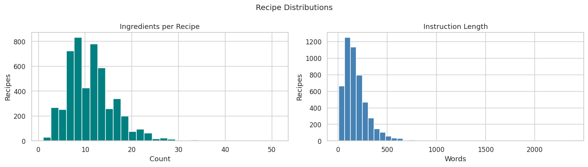
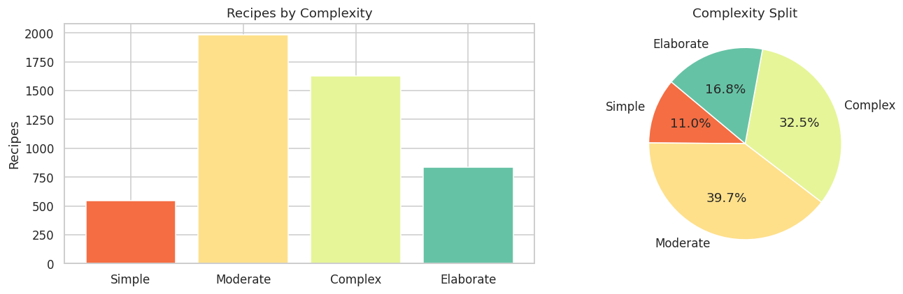
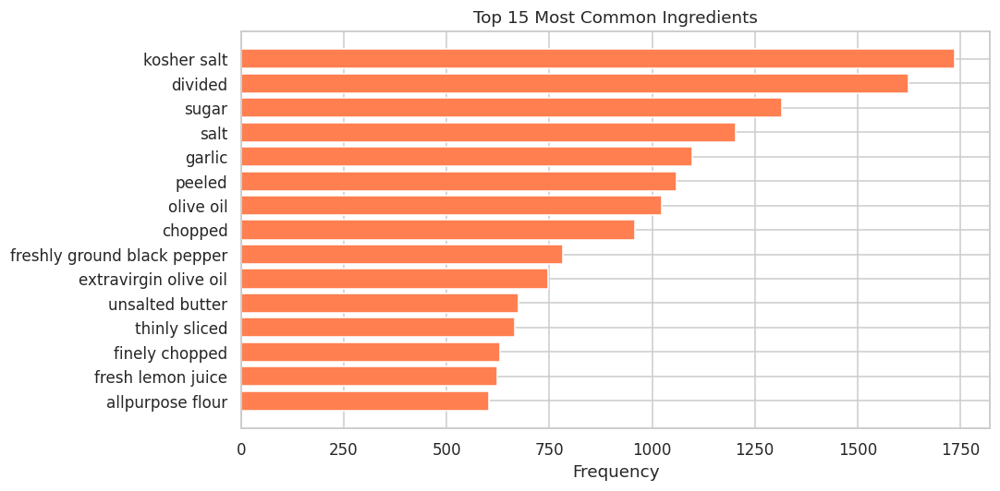
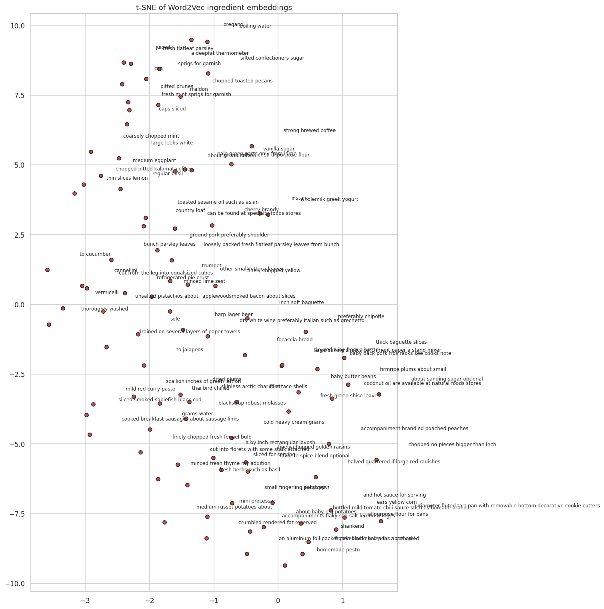
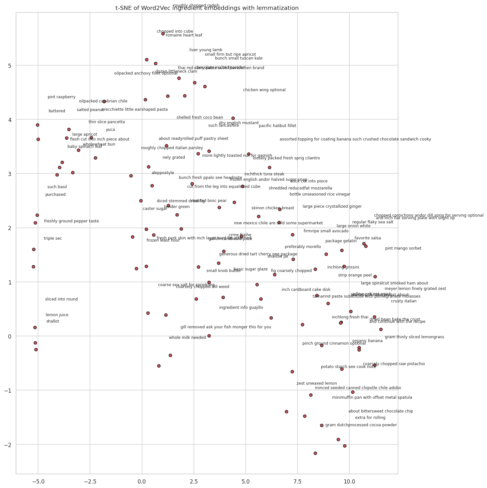
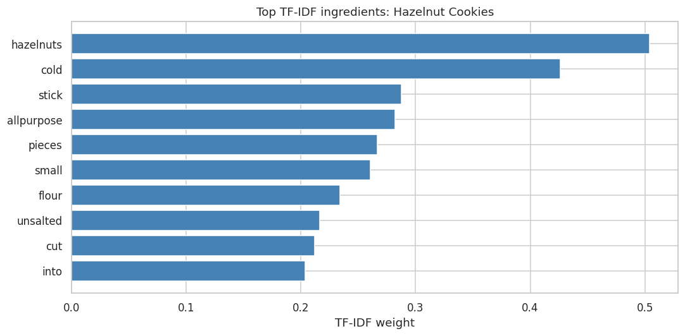
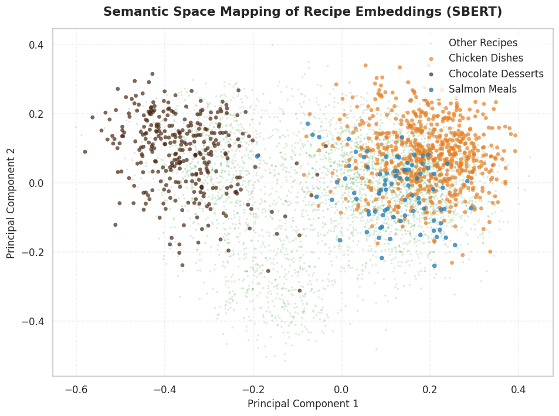

# Cookify - A Smart Recipe Recommender from Available Ingredients

Cookify is a recipe recommendation system that suggests meals based on ingredients you already have, using text preprocessing and similarity matching.

## Table of Contents
1. [Overview](#overview)
2. [Project Structure](#project-structure)
3. [Dataset](#dataset)
4. [Model Architecture](#model-architecture)
5. [Evaluation and Comparison](#evaluation-and-comparison)
6. [Final Model](#final-model-tf-idf--lemmatization-with-sbert-re-ranking)
7. [User Interface](#user-interface)
8. [Conclusion](#conclusion)
9. [License](#license)

# Overview

**Cookify** is an ingredient-based recipe recommendation system created to help users decide what to cook using the ingredients they already have. The aim is to save time when choosing meals and reduce food waste. The system utilizes text preprocessing and similarity matching to compare user-input ingredients with a dataset of recipes and recommend the most relevant matches.

- **Dataset:** The model is trained on *Food Ingredients and Recipes Dataset with Images* dataset, which contains over 13,000 different recipes.
-  **Preprocessing:** Recipe ingredients are cleaned and normalized by removing quantities, measurement units and punctuation to ensure consistent ingredient representation.
-  **Similarity Matching:** The system compares user's input ingredients with recipe ingredient sets using similarity measurement to identify and rank the most relevant recipes.

# Project structure
| Component | Description |
|-----------|-------------|
| UI/ | Folder with UI requirements |
|assets/ | Visualization images |
| data/ | Recipe dataset |
| images/ | Images of the recipes |
| pipeline_v1/ | Old pipeline version |
| src/ | Main source code modules |
| .gitignore | Specifies folders and files to exclude from version control |
| README.md | Project documentation |
| main.py | Complete pipeline execution script |
| requirements.txt | Python dependencies |

Note: We keep old pipeline as a reference only, but for production, src/ folder is recommended.

We also provide a Google Colab notebook link to allow insight to our conclusions and comments, as well as outputs: https://colab.research.google.com/drive/1gEd4TN6vSX3XSMjii869Ol5RsgeZds26?usp=sharing. It is not for production purposes, but rather for gaining understanding about our process. For production use, the modular code in src/ is recommended.

# Dataset
## Step 1: Data Source
Cookify uses the [*Food Ingredients and Recipes Dataset with Images*](https://www.kaggle.com/datasets/pes12017000148/food-ingredients-and-recipe-dataset-with-images) dataset that includes 13,582 recipes, covering a wide variety of different cuisines and ingredient combinations. Each recipe has 5 features:
1) **Title:** Name of the meal
2) **Ingredients:** Contains ingredients in the form they were scrapped from the website
3) **Instructions:** Includes steps to follow when making the recipe
4) **Image Name:** A reference to the meal image in the *Food Images* zip folder
5) **Cleaned Ingredients:** Contains processed and cleaned ingredients

## Exploratory Data Analysis (EDA)

The Exploratory Data Analysis was performed on a random sample of **5,000 recipes** drawn from the full *Food Ingredients and Recipe Dataset with Image Name Mapping* dataset (`random_state=42`).

### 1. Dataset Overview

| Feature | Value |
| :--- | :--- |
| **Rows (recipes)** | 5,000 |
| **Columns** | 5 (`Title`, `Ingredients`, `Instructions`, `Image_Name`, `Cleaned_Ingredients`) |
| **Duplicate Rows** | 0 *(Note: Some recipes share titles but differ in content)* |

### 2. Engineered Features

Three numeric features were created to characterize each recipe:
* `num_ingredients`: Number of items in `Cleaned_Ingredients` (proxy for recipe complexity).
* `instr_word_count`: Word count of `Instructions` (proxy for recipe verbosity).
* `title_word_count`: Word count of `Title`.

| Feature | Mean | Median | Std |
| :--- | :---: | :---: | :---: |
| **num_ingredients** | ~9.5 | 9 | ~4.6 |
| **instr_word_count** | ~155 | 120 | ~130 |
| **title_word_count** | ~4.0 | 4 | ~1.8 |

Both `num_ingredients` and `instr_word_count` are **right-skewed**: most recipes are short and simple, but a long tail of elaborate recipes pulls the mean upward.

### 3. Recipe Complexity Distribution

Recipes were binned into four complexity tiers based on their ingredient count:

* **Simple** (1–5 ingredients): ~15% share
* **Moderate** (6–10 ingredients): ~50% share
* **Complex** (11–15 ingredients): ~25% share
* **Elaborate** (16+ ingredients): ~10% share

**Moderate recipes dominate the dataset.** Average instruction length grows steadily with complexity (Moderate recipes average ~120 words, while Elaborate recipes average ~250 words), confirming that ingredient count is a highly reliable proxy for overall recipe difficulty.

### 4. Ingredient Frequency Analysis

Before counting, ingredient strings were pre-processed to reduce text noise by splitting compound entries, normalising to lowercase without units, and filtering short tokens. The final vocabulary contained **~3,700 unique normalized ingredient tokens**.

#### Top 15 Most Frequent Ingredients:
1. **Salt** (2,800+ counts)
2. **Butter** (2,200+ counts)
3. **Sugar** (2,100+ counts)
4. **Olive Oil** (1,900+ counts)
5. **Garlic** (1,800+ counts)
6. **Pepper** (1,700+ counts)
7. **Flour** (1,600+ counts)
8. **Egg** (1,500+ counts)
9. **Onion** (1,400+ counts)
10. **Water** (1,300+ counts)
11. **Milk** (1,100+ counts)
12. **Lemon** (1,000+ counts)
13. **Chicken** (950 counts)
14. **Cream** (900 counts)
15. **Tomato** (850 counts)

### 5. Ingredient Co-occurrence & Correlations

A co-occurrence matrix built for the top 10 ingredients revealed clear culinary patterns:
* **Baking Dominance:** `butter–sugar` and `butter–flour` are the strongest ingredient pairs.
* **Savoriness:** `garlic–olive oil` and `garlic–onion` are the dominant savory co-occurrence pairs.
* **Salt Prevalence:** Salt co-occurs broadly with almost every top ingredient, making it the least discriminative feature for data retrieval.

#### Feature Correlations (Pearson r):
* `num_ingredients` ↔ `instr_word_count`: **~0.35** (Moderate positive correlation)
* `num_ingredients` ↔ `title_word_count`: **~0.05** (No correlation)
* `instr_word_count` ↔ `title_word_count`: **~0.02** (No correlation)

## Step 2: Data Cleaning
Due to computational constraints, we randomly sample 5,000 recipes. Random sampling ensures representative coverage of the whole dataset.
The raw dataset contains malformed rows and missing values. Because of this, we:
1) Removed rows with missing Title or Instructions;
2) Parsed ingredient lists from string format to Python lists;
3) Filtered recipes with empty ingredient lists

## Step 3: Ingredient Preprocessing
We normalized recipes by:
1) Removing quantities and measurement units (cups, tbsp, oz,...);
2) Stripping punctuation and convert everything to lowercase;
3) Applying optional lemmatization to reduce words to base form

# Model architecture
## Experiment 1: Word2Vec Without Lemmatization
### Step 1: Word2Vec training
We train a Word2Vec skip-gram model on the ingredient corpus extracted from the recipes. We use the skip-gram variant because we expect it to better perform on rare ingredients than Continuous Bag of Words would, since it predicts the surrounding words based on the given word.
The model learns vector representations of indvidual igredient tokens, capturing semantic relationships between similar ingredients. For example, 'salt' and 'pepper' as common seasonings are positioned close in the embedding space, whereas 'salt' and 'banana' should be placed further apart.

**Model configuration:**
- **Vector size:** 100 dimensions (how many numbers represent each ingredient in the vector space)
- **Window size:** 5 (determines how many context words should be predicted on each side)
- **Min count:** 1 (includes all ingredients if they show even once)
- **Training algorithm:** sg=1 (Skip-gram)

### Step 2: Recipe vectorization
Each recipe is represented as a single vector by averaging the Word2Vec embeddings of all its ingredient tokens. This captures the overall profile of the recipe by comining individual ingredient semantics.

### Step 3: Similarity matching and recommendation
User ingredients are converted to vectors using the same averaging method. We compute cosine similarity between the user's ingredient vector and all recipe vectors, then rank them and return the top-N most similar recipes.

**Visualization of ingredient embeddings:**

### Results:
Similarity scores are clustered tightly, limiting the ability to distinguish between recipes. The clustering is also visible in the t-SNE projection shown above, where the ingredient embeddings do form semantic clusters, but the problem manifests at the recipe level. This is likely due to vector averaging causing all recipe vectors to converge to similar regions in embedding space.
The recommendation quality is also low, with most recommended recipes having 0-2 matched ingredients. In the next experiment, we try to improve these results by introducing lemmatization.

## Experiment 2: Word2Vec With Lemmatization
### Step 1: Build the lemmatizer
We build a lemmatizer that will potentially enhance the results of the first experiment, since lemmatization reduces a word to its root form (lemma), considering its meaning and part of speech. For this, we use WordNetLemmatizer.

### Step 2: New Word2Vec training with lemmatization
We again train the same Word2Vec model as in the first experiment, but we apply it to the new corpus, obtained by applying the normalisation function with lemmatization.

### Step 3 and Step 4: Recipe vectorization, similarity matching and recommendation
The last two steps are the same as in the first experiment.

### Results:
**Visualization of ingredient embeddings:**

### Results:
The results of this experiment were very similar to those obtained in Experiment 1. The similarity scores are still clustered closely around 0.99 and the improvement in the number of matched ingredients is not very meaningful. The problem is also seen in the visualization shown above, where there are no significantly more meaningful clusters than in the first experiment. This led us to the conclusion that lemmatization alone is not enough to resolve the problems from the first experiment. The limitation of vector averaging is still fundamental. In the next experiment, we will try a new approach and fit TF-IDF.

## Experiment 3: TF-IDF Without Lemmatization
### Step 1: TF-IDF vectorization
Now, we replace Word2Vec embeddings with a TF-IDF (Term Frequency-Inverse Document Frequency) representation. It is a frequency-based approach that represenets each recipe as a weighted vector of ingredient terms.
TF-IDF is suitable for a recipe recommendation system because it assigns weights to words, based on how often they appear. For an example, common ingredients, such as 'salt' should recieve lower weight, while more distinctive ingredients receive higher weights. This way, TF-IDF may address the low number of ingredient matches observed in the Word2Vec experiments.

To prepare the data, we converted each recipe's ingredient list into a single string, since TF-IDF expexts text documents as input.
Then, the vectorizer is fitted on the entire recipe corpus, resulting in a sparse matrix where each row represents a recipe and each column a vocabulary term.

**Model configuration:**
- **Vectorizer:** TF-IDF
- **Input:** normalized ingredients strings
- **Representation:** sparse term-weight matrix
- **Similarity metric:** Cosine similarity

### Step 2: Similarity matching and recommendation
For recipe recommendation, the user's ingredient list is processed using the same normalisation pipeline as the recipes. The resulting ingredients are joined into a query string and then transformed into a TF-IDF vector using the fitted vectorizer.
Then, like in the first two experiments, we compute cosine similarity between the user's input and all recipe vectors. Again, the recipes are ranked according to similarity score and the top-N most similar ones are returned as recommendations.

### Results:
TF-IDF model showed a noticeable improvement over both Word2Vec experiments. The similarity scores are distributed into a much wider range instead of being clustered around a single value. Hence, cosine similarity can better distinguish between recipes and produce a more meaningful ranking.
However, the number of matched values remains relatively low. This suggests that query terms still fail to match more descriptive ingredient names. 
Overall, TF-IDF experiment significantly outperformed the Word2Vec approaches, since it avoids the vector averaging problem. Because of this improvement, we resume with TF-IDF approach and now investigate whether lemmatization can further improve its performance. 

The chart shows the TF-IDF weights for a sample recipe (Hazelnut Cookies). It is visible that the top rated ingredients are relevant to the recipe, while more common modifiers receive lower weights.

### Results:
TF-IDF model showed a noticeable improvement over both Word2Vec experiments. The similarity scores are distributed into a much wider range instead of being clustered around a single value. Hence, cosine similarity can better distinguish between recipes and produce a more meaningful ranking.
However, the number of matched values remains relatively low. This suggests that query terms still fail to match more descriptive ingredient names.
Overall, TF-IDF experiment significantly outperformed the Word2Vec approaches, since it avoids the vector averaging problem. Because of this improvement, we resume with TF-IDF approach and now investigate whether lemmatization can further improve its performance.

## Experiment 4: TF-IDF With Lemmatization
### Step 1: Lemmatized TF-IDF vectorization
In this experiment, we will combine the TF-IDF from Experiment 3 with the lemmatization procedure from Experiment 2. The reasoning is the same as before: lemmatization reduces words to their base form, while considering their meaning and grammatical role. Applying lemmatization may improve the representation by merging different forms of the same words.
As in the previous experiment, each recipe is converted into a string of normalized ingredient tokens, but normalisation process now includes lemmatization before fitting the TF-IDF vectorizer.
**Model configuration:**
- **Vectorizer:** TF-IDF
- **Preprocessing:** Tokenization and lemmatization
- **Representation:** Sparse term-weight matrix
- **Similarity metric:** Cosine similarity

### Step 2: Similarity matching and recommendation
The recommendation process is the same as in Experiment 3, as well as computing cosine similarity.

### Results:
The model performs modestly, but consistently better than the non-lemmatized TF-IDF model. Similarity scores are generally slightly better, but the improvement is not dramatic. Still, this experiment produced the best overall results out of the first four experiments.

## Experiment 5: SBERT (Sentence-BERT)
**Overview:**
Unlike the previous four experiments that rely on individual ingredient token matching, SBERT (Sentence-BERT) encodes the entire recipe, including its title and ingredints list as a single dense vector using a pretrained transfomer model. This allows the system to capture semantic meaning at a higher level, going beyond exact keyword matching.
We use the pretrained 'all-MiniLM-L6-v2' model, a lightweight but high-performance sentence emedding model. Since SBERT already understands language at a deep level, lemmatization will not be included as a part of the experiment.

### Building the natural language corpus
Each recipe is converted into a natural language sentence combining the recipe and its ingredient list. This gives SBERT the full context of the recipe, rather than just a bag of tokens. This is an important difference from the previous experiments: SBERT encodes the entire recipe, inluding its title and ingredient list, as a single sentence, while previous experiments treated recipes as a bag of individual tokens. Due to this, the SBERT model gains additional contet about the type of dish.

**Model configuration:**
- **Model:** 'all-MiniLM-L6-v2'
- **Input:** Natural language sentence (title an ingredients)
- **Representation:** Dense 384-dimensional vector
- **Similarity metric:** Cosine similarity

The visualization shows how SBERT encodes recipes as semantic vectors and clusters them in 2D space. Recipes are naturally grouped into relevant categories, showing SBERT's ability to capture high-level semantic meaning beyond individual ingredients.

### Results:
The SBERT model produced the most semantically relevant recommendations out of all five experiments. Unlike Word2Vec, the similarity scores are in a meaningful range and unlike TF-IDF, the recommendations capture the overall cooking context and not just keyword overlap.

The num_matched scores still remain low due to the same mismatch between individual tokens and full inredient phrases observed in the previous experiments.

Overall, the SBERT model outperforms all of the previous experiments in recommendation relevanece, leading us to the conclusion that semantic sentence embeddings are better suited for this task than token-level approaches.

# Evaluation and Comparison

To evaluate the results of the experiments, we will use the following metrics:
 - **Precision@5:** Measures how many of the top 5 recommended recipes are relevant. The higher score indicates better ranking quality.
 - **Recall@5:** Measures how well the system retireves query ingredients across the top 5 results. The higher score, the better (more query ingredients are found)
 - **Coverage:** The average proportion of query ingredients matched per recommendation. The higher score indicates that more query ingredients are captured.
 - **Best rank:** The position of the highest-scoring relevant recipe. Lower values are better as they propose that relevant results appear earlier in the ranking.

| Model | Precision@5 | Recall@5 | Coverage | Best rank |
|-------|-------------|----------|----------|-----------|
| Word2Vec| 0.67 | 0.38 | 0.48 | 1-4 |  
| Word2Vec with lemmatization | 0.80 | 0.32 | 0.31 | 1-4 |
| TF-IDF | 0.47 | 0.18 | 0.22 | 1-3 |
| TF-IDF with lemmatization | 0.73 | 0.26 | 0.26 | 1-3 |
| SBERT | 0.73 | 0.39 | 0.38 | 1-2 |

**Conclusion:**
From the table and results of each experiment, it is visible that the **Word2Vec** models achieve consistently high cosine similarity scores. However, this did not reflect in their performance. Even though Precision@5 is relatively high, Recall@5 and Coverage remain limited, indicating that the models fail to fully capture all query ingredients. Furthermore, lemmatization did not significantly improve Word2Vec performance, since the problem of word embeddings averaging is still present.
**TF-IDF** models show clear improvement in ranking quality. Unlike, W2V, it produces more varied similarity scores and improves the system's ability to distinguish between recipes. The lemmatization further improves its performance, with all metrics being better, confirming that normalization helps reduce vocabulary mismatch. However, TF-IDF still struggles with semantic understanding, especially when ingredient expressions differ from exact query tokens.
**SBERT** achieves the most consistent overall performance, with relevant recipes appearing in top positions. This shows that SBERT is more effective at capturing semantic similarity between recipes and user queries compared to token-based methods.

Based on this, we decide to continue with the combination of TF-IDF with lemmatization for reliable lexical matching and SBERT due to its strong semantic retrieval and ranking quality. This will combine TF-IDF's robust keyword matching and SBERT's deep contextual understanding.

# Final model: TF-IDF + lemmatization with SBERT Re-ranking
## Overview:
To combine the best features of TF-IDF with lemmatization (exact ingredient matching) amd SBERT (semantic relationships between queries and recipes), we will build a two-stage recommendation pipeline. The first stage uses TF-IDF with lemmatization to efficiently retrieve a set of candidate recipes and the second stage applies SBERT to re-rank those candidates according to semantic similarity.

### Step 1: Candidate retrieval using TF-IDF with lemmatization
First, the user's ingredients are processed using the same normalization and lemmatization process from Experiment 4. The resulting tokens are transformed into a TF-IDF vector using the fitted TF-IDF model. Then, cosine similarity is computed between the query vector and all recipe vectors in the corpus. The system returns te top 50 candidate recipes, creating a smaller and more relevant search space for the semantic re-ranking.

### Step 2: Semantic re-ranking using SBERT
The candidate recipes obtained in the previous step are re-evaluated using SBERT. The system constructs a natural-language quey from the user's ingredients and encodes it using the same SBERT model as in Experiment 5. The SBERT embeddings are compared with the embeddings of the candidate recipes using cosine similarity. They are then sorted according to their semantic similarity scores.

### Step 3: Final recommendation generation
The final result of the system is the top-N highest-ranked recipes. The final recommendations contain ingredients that closely match the user's query and are conceptually related to the kind of meal that a user is looking for.

**Results:**
| Precision@5 | Recall@5 | Coverage | Best rank |
|-------------|----------|----------|-----------|
| 1.00 | 0.87 | 0.87 | 2-2 |

The hybrid model achieves perfect precision across test queries, meaning all top-5 recommendations contain at least one matching ingredient. However, it is important to note that the evaluation was done on a smaller set of common ingredients and the precision in the case of a more complex query is expected to be lower. The high recall (0.87) and coverage (0.87) demonstrate that the system successfully recovers most of the user's input ingredients across recommendations.

# User-Interface
The user-interface was made using Streamlit, which is an open-source Python framework designed to develop and deploy interactive applications via Python.
The folder UI/ includes all files needed for the app to work. The application uses functions from Python modules stored in the repository. However, some functions were adjusted and modified to integrate them into the user interface in order to make them capable of returning outputs, messages and keys.
To improve the visual appearance and user experience of the application, custom CSS and HTML elements have been added along with Streamlit elements.
The application was deployed on Streamlit Community Cloud, which provided a public URL that allows users to access the web application directly through a browser.

The web application can be accessed through the following link: https://cookify.streamlit.app/

For a demonstration of how to use the Cookify application, watch the video below:

https://github.com/user-attachments/assets/2b087c9c-1e77-4dff-9b8a-c74f39348b4c

# Conclusion
In conclusion, the hybrid recommendation approach outperforms single-method baselines.
Word2Vec's semantic embeddings fail due to vector averaging, while TF-IDF's lexical matching lacks semantic understanding. By combining TF-IDF's computational efficiency and precise keyword matching with SBERT's ability at understanding context, we created a practical system that delivers both accuracy and performance.

# License
This project is licensed under MIT License. See [LICENSE](LICENSE) file for details.
